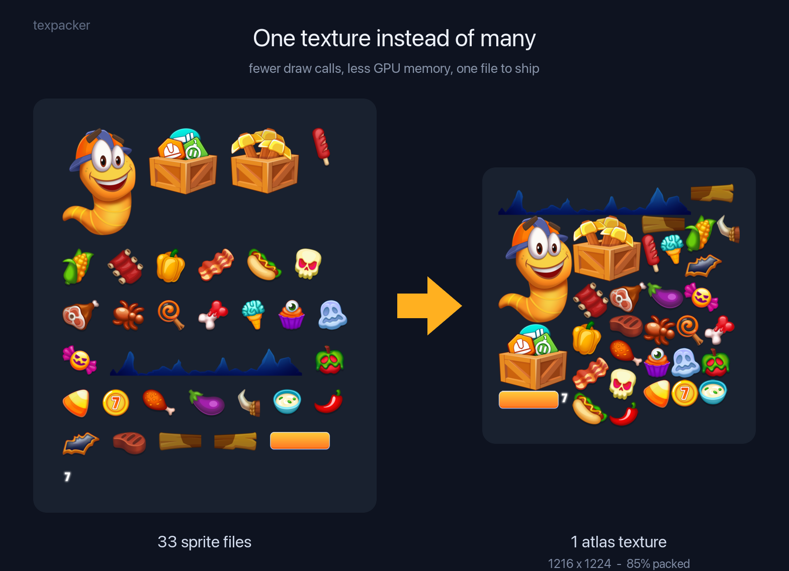
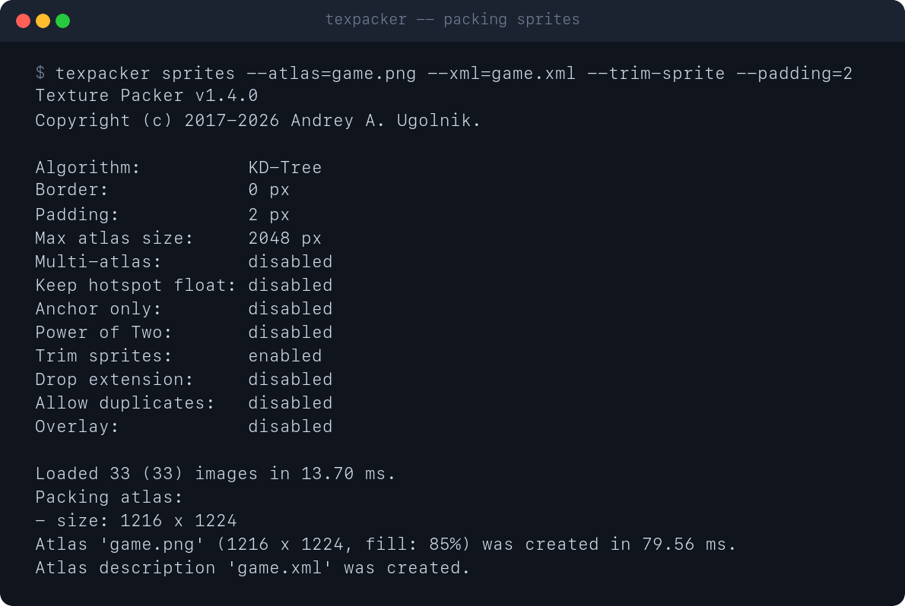

# Texture Packer

[](https://ci.appveyor.com/project/reybits/texture-packer/branch/master "Branch: master")
[](LICENSE)
[](https://en.cppreference.com/w/cpp/17)
[](#download-and-build)

**A fast, free, open-source command-line texture atlas packer for game development.**



`texpacker` combines many images into a single optimized texture atlas, minimizing
memory usage and boosting rendering performance. It sorts sprites, packs them tightly
with advanced algorithms, trims wasted transparency, and writes XML metadata describing
every sprite. No GUI, no license fees, no cloud account: one small binary that drops
straight into your build scripts and CI pipelines.

## Why texpacker

- **Free and open source.** MIT licensed, no watermarks, no paywalled features.
- **Command-line first.** Scriptable and reproducible; integrates into Makefiles,
  CMake, npm scripts, and CI/CD out of the box.
- **Fast.** Packs dozens of sprites in tens of milliseconds.
- **Zero dependencies to install.** A single self-contained binary; image codecs are
  bundled.
- **Cross-platform.** Builds and runs on Linux, macOS, and BSD.

## Features

### Packing

- Two packing algorithms: **MaxRects** (default, densest) and **KD-Tree**; `--algorithm=auto` packs with both and keeps the smaller atlas.
- **Multi-atlas** output when the sprite set exceeds the maximum atlas size.
- Optional **power-of-two** atlas dimensions for older GPUs.
- Configurable **border** and **padding** to prevent texture bleeding.

### Optimization

- **Trims** transparent borders from sprites to reclaim wasted space.
- **Deduplicates** identical sprites automatically, storing each only once while every
  reference still resolves.
- Emits per-sprite **hotspot** and normalized **anchor** points for pivot-aware engines.

### Input and output

- Reads **JPEG, PNG, TGA, BMP, PSD, GIF, HDR, PIC, PNM**.
- Writes **PNG** (default), **TGA**, or **BMP** atlas images.
- Writes **XML** metadata with texture path, rect, hotspot, and anchor per sprite.
- Discovers images from directories (recursively) or takes explicit file paths.

## Example

Point `texpacker` at a folder of sprites and it packs them into one tight sheet:



```sh
texpacker sprites --atlas=game.png --xml=game.xml --trim-sprite --padding=2
```

## Usage

```sh
texpacker INPUT_IMAGE [INPUT_IMAGE] <OPTIONS> --atlas=PATH
  INPUT_IMAGE        Input image file or directory (space-separated)
  --algorithm=NAME   Packing algorithm: kdtree, maxrects, auto (default: maxrects)
  --allow-dupes      Allow duplicate sprites (default: false)
  --anchor-only      Omit hotspot, keep anchor only (default: false)
  --atlas-size=SIZE  Maximum atlas size (default: 2048 px)
  --atlas=PATH       Output atlas file name (default: PNG)
  --border=SIZE      Add border around sprites (default: 0 px)
  --keep-float       Preserve float hotspot coordinates (default: false)
  --multi-atlas      Enable multi-atlas output (default: false)
  --no-recurse       Do not search subdirectories
  --overlay          Overlay sprites (default: false)
  --padding=SIZE     Add padding between sprites (default: 1 px)
  --pot              Make atlas dimensions power of two (default: false)
  --prefix=PREFIX    Add prefix to texture path
  --trim-id=COUNT    Remove COUNT characters from the start of sprite IDs (default: 0)
  --trim-sprite      Trim transparent borders from sprites (default: false)
  --xml=PATH         The output file path for the atlas description in XML format
```

## Download and build

Requires CMake 3.22+ and a C++17 compiler. Works on Linux, macOS, and BSD.

```sh
git clone https://github.com/reybits/texture-packer.git
cd texture-packer
make release
```

## Install with Homebrew

```sh
brew tap reybits/homebrew-tap
brew install reybits/homebrew-tap/texture-packer
```

## Testing

Run the verification suite to check atlas output against committed reference files:

```sh
./tests/verify.sh
```

It compares atlas images and XML byte-for-byte against reference output across
many configurations (single and multi-atlas, power-of-two, border/padding,
anchor-only, keep-float, overlay), and additionally checks error-path exit codes,
TGA/BMP output, and sprite-trimming behavior.

To regenerate reference files after an intentional change in packing behavior:

```sh
./tests/verify.sh --update
```

## Input format notes

- **JPEG** baseline & progressive (12 bpc/arithmetic not supported, same as stock IJG lib).
- **PNG** 1/2/4/8-bit-per-channel (16 bpc not supported).
- **TGA** (not sure what subset, if a subset).
- **BMP** non-1bpp, non-RLE.
- **PSD** (composited view only, no extra channels, 8/16 bit-per-channel).
- **GIF** (*comp always reports as 4-channel).
- **HDR** (radiance rgbE format).
- **PIC** (Softimage PIC).
- **PNM** (PPM and PGM binary only).

***

```
Copyright © 2017-2026 Andrey A. Ugolnik. All Rights Reserved.
https://github.com/reybits
and@reybits.dev
```
